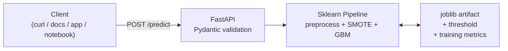

# Telco Customer Churn — End-to-End ML Deployment

A production-style churn prediction service for an IBM Telco subscriber dataset.
Trained pipeline, schema-validated FastAPI, Docker image, deployed on Render.

**Live API:** [`https://churn-api-5w4k.onrender.com/docs`](https://churn-api-5w4k.onrender.com/docs)
*(First request cold-starts in ~50 seconds on the free tier; subsequent calls are fast.)*

---

## What this does

A telco wants to identify subscribers who are likely to cancel in the next billing
cycle, so the retention team can call them before they leave. This project builds
that model end to end — from raw CSV to a public REST API you can `curl`.

The model achieves **ROC-AUC 0.84** on a held-out test set. At the cost-tuned
operating point, it recalls **93% of churners** at **42% precision** — a
workable trade for a retention campaign where a missed churner is ~5× more
expensive than an unnecessary retention offer.

## Try it

```bash
curl -X POST https://churn-api-5w4k.onrender.com/predict \
  -H "Content-Type: application/json" \
  -d '{
    "gender": "Female", "SeniorCitizen": 0, "Partner": "Yes", "Dependents": "No",
    "tenure": 2, "PhoneService": "Yes", "MultipleLines": "No",
    "InternetService": "Fiber optic", "OnlineSecurity": "No", "OnlineBackup": "No",
    "DeviceProtection": "No", "TechSupport": "No", "StreamingTV": "Yes",
    "StreamingMovies": "Yes", "Contract": "Month-to-month", "PaperlessBilling": "Yes",
    "PaymentMethod": "Electronic check", "MonthlyCharges": 95.0, "TotalCharges": 190.0
  }'
```

Response:

```json
{
  "churn_probability": 0.657,
  "churn_prediction": 1,
  "threshold": 0.24,
  "risk_band": "high"
}
```

## Architecture



**Deployment:** Docker (Python 3.11-slim) → Render. CI auto-deploys on push to `main`.

## Results

| Metric | Value |
|---|---|
| Test ROC-AUC | 0.841 |
| Test PR-AUC | 0.649 (baseline 0.265) |
| CV ROC-AUC (5-fold) | 0.847 ± 0.012 |
| Cost-tuned threshold | 0.24 |
| Recall at threshold | 93% |
| Precision at threshold | 42% |

Cost-tuning assumes FN:FP = 5:1 (missed churner is 5× more expensive than a
wasted retention offer). In production this ratio should come from finance,
not the data scientist.

## What's in the repo
```text
.
├── app.py                 FastAPI service with /health, /predict, /predict/batch
├── train.py               End-to-end training: load → split → grid-search → evaluate → save
├── predict.py             Batch scoring CLI: takes a CSV, writes predictions
├── src/
│   ├── schema.py          Input contract: required columns, types, valid categories
│   ├── data.py            Load + clean (fixes TotalCharges dtype bug)
│   ├── features.py        ColumnTransformer: scale numerics, one-hot categoricals
│   ├── models.py          Pipeline builder: preprocessor + SMOTE + classifier
│   ├── threshold.py       Cost-based threshold tuning
│   ├── evaluate.py        Metrics + EvaluationReport dataclass
│   └── api_schemas.py     Pydantic request/response models for the API layer
├── tests/                 29 unit + integration tests, including API contract tests
├── notebooks/
│   └── telco-customer-churn-analysis.ipynb
├── models/
│   ├── churn_pipeline.joblib
│   └── training_metrics.json
├── Dockerfile
├── docker-compose.yml
├── render.yaml
├── requirements.txt
└── README.md
```
## How it's built

**Modeling.** Three classifiers compared on 5-fold stratified CV scored on ROC-AUC:
logistic regression, random forest, gradient boosting. Gradient boosting wins
and gets grid-searched over `n_estimators`, `max_depth`, `learning_rate`. SMOTE
is applied inside each CV fold (via `imblearn.pipeline.Pipeline`), not once
before CV — the latter inflates CV scores because synthetic samples leak across
folds.

**Preprocessing.** `ColumnTransformer` with `StandardScaler` on four numerics and
`OneHotEncoder(drop="if_binary", handle_unknown="ignore")` on fifteen
categoricals. The schema (`src/schema.py`) is the source of truth — the
preprocessor, the validator, and the API Pydantic models all derive from it.

**Threshold tuning.** The default 0.5 threshold is a convention, not a decision.
The right threshold depends on the relative cost of a false negative vs. a false
positive. `src/threshold.py` sweeps 91 thresholds and picks the one minimising
`5 × FN + 1 × FP` on a held-out validation slice of the training data — not the
test set, to keep the final evaluation honest.

**API.** FastAPI with Pydantic request/response models. Endpoints:
- `GET /health` — liveness + model-loaded check, returns deployed model metrics.
- `POST /predict` — score one customer.
- `POST /predict/batch` — score up to 1000 customers in one request.
- `GET /docs` — interactive Swagger UI.

Invalid requests (missing fields, unknown categories, wrong types, extra fields)
return `422` with field-level error messages. `extra="forbid"` on the Pydantic
schema means the API rejects unknown fields rather than silently ignoring them —
this prevents a class of production bug where a renamed upstream field gets
dropped without anyone noticing.

**Deployment.** Multi-stage Docker build (builder stage installs pip packages;
runtime stage copies only the venv — smaller image, no build tools at runtime).
Runs as a non-root user. Healthcheck at `/health` every 30s. Port is
configurable via `$PORT` so the same image runs on Render, Fly.io, AWS ECS,
or anywhere else that sets the variable.

## Reproduce locally

```bash
git clone https://github.com/sanan3323/telco-customer-churn.git
cd telco-customer-churn

# Download the dataset from Kaggle (Kaggle ToS prohibits committing it):
#   https://www.kaggle.com/datasets/blastchar/telco-customer-churn
# Place it at data/raw/CustChurn.csv

python3 -m venv .venv && source .venv/bin/activate
pip install -r requirements.txt

python train.py              # train + persist the pipeline (~2 min)
pytest tests/ -v             # 29 tests should pass
uvicorn app:app --reload     # serves on http://localhost:8000
```

Or with Docker:

```bash
docker compose up            # builds and runs
curl http://localhost:8000/health
```

## Limitations

- **Cost ratio is assumed, not measured.** Real deployment should use a finance-
  sourced ratio from customer LTV and retention-offer economics.
- **No temporal split.** Churn is genuinely a time-series problem; this dataset
  is a single snapshot. A production version would split chronologically and
  monitor for concept drift.
- **Predicts churn, not uplift.** This model identifies who will churn, not who
  will be persuaded by an offer. Uplift modelling is the right tool for the
  latter question and is out of scope here.
- **Free-tier cold start.** Render spins the service down after 15 minutes of
  inactivity. First request after sleep takes ~50 seconds; subsequent requests
  are fast. Not a limitation of the service, a limitation of the free plan.
